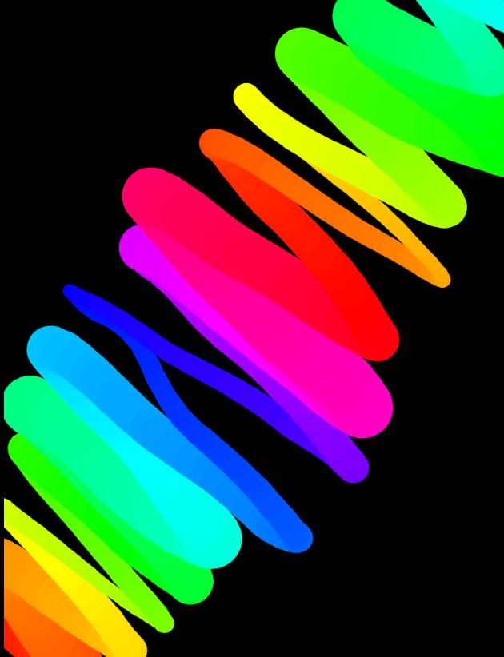

# Canvas Drawing App

An interactive canvas drawing app where users can unleash their creativity by drawing on a full-screen canvas with dynamic stroke colors and adjustable line widths. The app is responsive, and works across both desktop and mobile devices.

## Description

This project implements a drawing application using an HTML `<canvas>`, where users can draw with their mouse or touch. The app features dynamic stroke colors that change based on a hue, and line widths that adjust as users draw. The canvas automatically resizes to fill the entire browser window and is fully responsive, making it accessible for both desktop and mobile users. The app is built using HTML, CSS, and JavaScript.

## Features

- Full-screen interactive canvas for drawing.
- Dynamic stroke colors that change as the user draws, based on hue.
- Adjustable line width that changes smoothly as users draw.
- Responsive design that adapts to different screen sizes (desktop and mobile).
- Supports both mouse and touch events for a versatile user experience.
- The canvas automatically resizes when the window is resized.

## Technologies Used

- HTML
- CSS
- JavaScript
- Canvas API

## How to Run

1. Clone the repository to your local machine.
2. Open `index.html` in your web browser to start drawing.
3. Alternatively, you can view the live project on GitHub Pages: [Canvas Drawing App on GitHub Pages](https://deannamandarino.github.io/canvas-drawing/).

## Acknowledgments

This project was completed as part of the JavaScript30 course. Special thanks to Wes Bos for the excellent resources and guidance throughout the course.